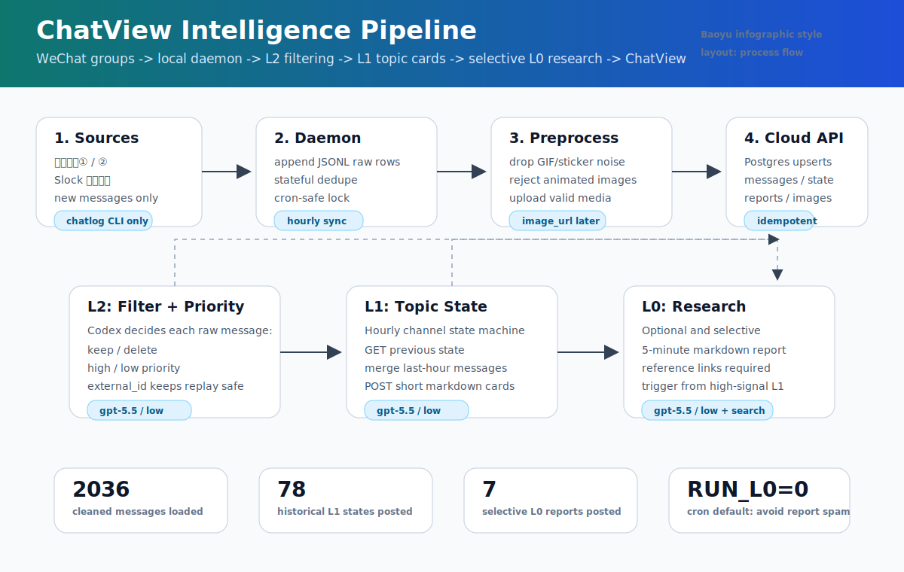

# ChatView

ChatView L2 viewer and cleaned-message ingestion API.

## System Infographic

The project uses the Baoyu Infographic pattern: pick an information layout and a visual style, then compress the system into a dense visual summary. This diagram uses a process-flow layout with a technical schematic style.



## What Is Implemented

- `public/ChatView.html`: three-column ChatView UI.
- L2 consumes the message API contract.
- L1 consumes saved channel state snapshots from `/api/channel-state`.
- L0 consumes saved research reports from `/api/reports`.
- Channel filter, high/all priority filter, local favorites, image thumbnails, lightbox, and message detail fetch are implemented. Search is present but disabled pending a clearer workflow.
- `server.js`: Node HTTP server with Postgres support on Railway and an empty in-memory fallback locally.
- `POST /api/messages`: authenticated daemon ingestion endpoint for cleaned messages.
- `POST /api/images`: authenticated image upload endpoint, backed by Postgres when `DATABASE_URL` is configured.
- `POST /api/channel-state`: authenticated L1 channel state upsert endpoint.
- `POST /api/reports`: authenticated L0 report upsert endpoint.
- `daemon/`: local `chatlog` CLI sync daemon, Codex filtering/state/report pipeline, cron wrapper, schemas, and backfill tooling.

No mock or seed messages are bundled in the repo.

## Run Locally

```sh
npm install
CHATVIEW_API_KEY=dev_key npm start
```

Open:

```text
http://localhost:3000/ChatView.html
```

## Read API

```http
GET /api/channels
GET /api/messages?channel_id=&priority=&limit=50&cursor=
GET /api/messages/{external_id}
GET /api/channel-state?channel_id=<id>&level=L1
GET /api/reports?level=L0&channel_id=&limit=20
```

`priority` supports `high`, `normal`, `low`, and `ignore`.

## Daemon Write API

```http
POST /api/messages
Authorization: Bearer <CHATVIEW_API_KEY>
Content-Type: application/json
```

Single message:

```json
{
  "external_id": "26929515373@chatroom:1779325379000001",
  "channel_id": "26929515373@chatroom",
  "channel": "芝士美股分享②群",
  "username": "灝Fung",
  "content": "日本有什么好股票吗",
  "image_url": null,
  "timestamp": 1779325379,
  "priority": "normal"
}
```

Batch:

```json
{
  "messages": [
    {
      "external_id": "26929515373@chatroom:1779325379000001",
      "channel_id": "26929515373@chatroom",
      "channel": "芝士美股分享②群",
      "username": "灝Fung",
      "content": "日本有什么好股票吗",
      "image_url": null,
      "timestamp": 1779325379,
      "priority": "normal"
    }
  ]
}
```

The endpoint also accepts `x-api-key: <CHATVIEW_API_KEY>`. Writes are upserts by `external_id`.

## L1 Channel State API

Latest channel state:

```http
GET /api/channel-state?channel_id=26929515373@chatroom&level=L1
```

Response:

```json
{
  "state": null
}
```

When present, `state` contains the persisted snapshot fields.

Upsert state:

```http
POST /api/channel-state
Authorization: Bearer <CHATVIEW_API_KEY>
Content-Type: application/json
```

```json
{
  "channel_id": "26929515373@chatroom",
  "level": "L1",
  "markdown": "...",
  "cards": [
    {
      "title": "资金面",
      "body": "缩表观点继续发酵",
      "priority": "high",
      "message_ids": ["..."]
    }
  ],
  "window_start": 1779465600,
  "window_end": 1779469200,
  "source_message_ids": ["..."],
  "previous_state_id": "st_prev_or_null"
}
```

`state_id` is generated when omitted. Writes are idempotent by `(channel_id, level, window_start, window_end)`.

## L0 Reports API

List reports:

```http
GET /api/reports?level=L0&channel_id=26929515373@chatroom&limit=20
```

Response:

```json
{
  "reports": []
}
```

Upsert report:

```http
POST /api/reports
Authorization: Bearer <CHATVIEW_API_KEY>
Content-Type: application/json
```

```json
{
  "report_id": "optional-idempotency-key",
  "level": "L0",
  "channel_id": "26929515373@chatroom",
  "title": "Fed 缩表与风险偏好的小时观察",
  "summary": "5 分钟可读摘要",
  "markdown": "markdown report with reference links and insight",
  "topics": ["Fed", "缩表", "风险偏好"],
  "references": [{"title": "source title", "url": "https://..."}],
  "window_start": 1779465600,
  "window_end": 1779469200,
  "source_state_ids": ["st_xxx"],
  "source_message_ids": ["..."]
}
```

`report_id` is generated when omitted. Writes are upserts by `report_id`.

## Image Upload API

Images are stored in Postgres when `DATABASE_URL` is configured. Without Postgres, the server falls back to process memory plus `UPLOAD_DIR` or `/tmp/chatview-uploads`, which is only suitable for local development.

Binary upload:

```http
POST /api/images
Authorization: Bearer <CHATVIEW_API_KEY>
Content-Type: image/png
```

Base64 JSON upload:

```json
{
  "filename": "message.png",
  "content_type": "image/png",
  "data_base64": "..."
}
```

Response:

```json
{
  "image_url": "https://chatview-production.up.railway.app/uploads/..."
}
```

Send that returned `image_url` in the later `POST /api/messages` payload.

## Railway

The app expects Railway to provide:

- Node service running `npm start`
- `DATABASE_URL` from Railway Postgres
- `CHATVIEW_API_KEY`
- `PORT` from Railway

## Local Daemon

Daemon code lives in `daemon/` so the cloud API, frontend, and local sync contract stay versioned together.

```sh
cd daemon
mkdir -p exports/follow_three_groups_jsonl
cp cloud.env.example exports/follow_three_groups_jsonl/cloud.env
chmod 600 exports/follow_three_groups_jsonl/cloud.env
```

Set `CLOUD_API_KEY` in `exports/follow_three_groups_jsonl/cloud.env`.

Hourly cron:

```cron
0 * * * * /path/to/chatview/daemon/scripts/cron_follow_three_groups.sh
```

The daemon expects local `chatlog` to be running:

```sh
chatlog http call --endpoint health --show-status=false
```

Cron defaults:

- `RUN_L1=1`
- `RUN_L0=1`
- `DECISION_BATCH_SIZE=20`
- `CODEX_MODEL=gpt-5.5`
- `CODEX_REASONING_EFFORT=low`
- `L1_PATCH_RETRIES=2`

## Model Settings

| Layer | Job | Codex command | Model | Thinking |
| --- | --- | --- | --- | --- |
| L2 | Message filtering and `high/low` priority labeling | `codex exec` | `gpt-5.5` | `low` |
| L1 | Hourly topic-state search/replace patches | `codex exec` | `gpt-5.5` | `low` |
| L0 | Selective research report with reference links | `codex --search exec` | `gpt-5.5` | `low` |

L1 no longer lets the model rewrite the whole state. The model returns search/replace instructions against the current L1 card document with `match: "single"` only; the executor requires each search to match exactly one block and retries with the error if a patch fails. Hourly cron triggers the L0 stage after L1. The L0 model should return `skip` unless the latest L1 cards are high-signal and research-worthy; avoid all-hour historical L0 backfills.

## References

- Baoyu Infographic: https://hermes-agent.nousresearch.com/docs/zh-Hans/user-guide/skills/bundled/creative/creative-baoyu-infographic
